# Distributed Systems Recipes

As we start to build distributed systems composed from microservices, we’ll also encounter nonfunctional requirements that we don’t normally encounter when developing a monolith. Sometimes the laws of physics get in the way of solving these problems, such as consistency, latency, and network partitions. However, the problems of brittleness and manageability can normally be addressed through the proper application of fairly generic, boilerplate patterns. In thissection we’ll examine recipes that help us with these concerns.

These recipes are drawn from a combination of the Spring Cloud project and the Netflix OSS family of projects.

## Versioned and Distributed Confguration

We discussed the importance of proper configuration management for applications in “Twelve-Factor Applications” on page 7, which specifies the injection of configuration via operating system-level environment variables. This method is very suitable for simple systems, but as we scale up to larger systems, sometimes we want additional configuration capabilities:

- Changing logging levels of a running application in order todebug a production issue

- Change the number of threads receiving messages from a mes‐sage broker

- Report all configuration changes made to a production systemto support regulatory audits

- Toggle features on/off in a running application

- Protect secrets (such as passwords) embedded in configuration

In order to support these capabilities, we need a configuration management approach with the following features:

- Versioning

- Auditability

- Encryption

- Refresh without restart

The Spring Cloud project contains a Config Server that provides these features. This Config Server presents application and application profile (e.g., sets of configuration that can be toggled on/off as a set, such as a “development” or “staging” profile) configuration as aREST API backed by a Git repository (Figure 3-1).

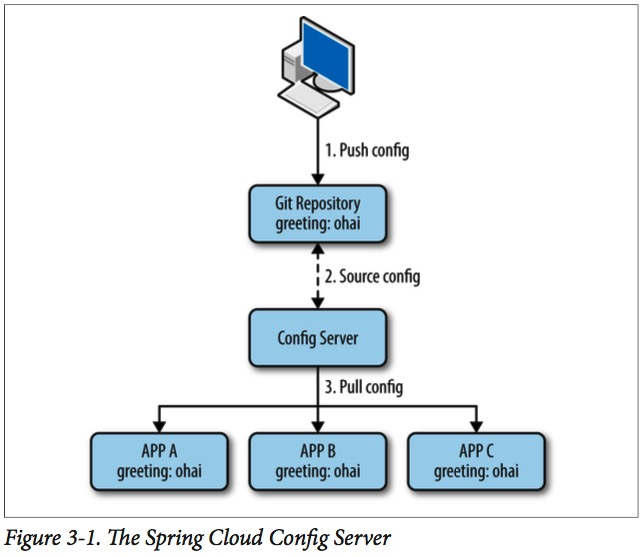

  Figure 3-1.  The Spring Cloud Config Server

  As an example, here’s the default application profile configuration for a sample Config Server (Example 3-1).

  Example 3-1. Default application pro le con guration for a sampleCon g Server

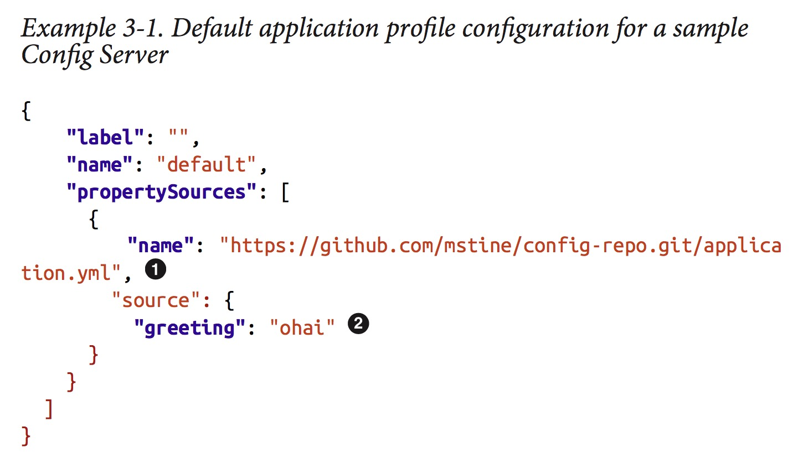

1. This configuration is backed by the file application.yml in thespecified backing Git repository.
2. The greeting is currently set to ohai.

  The configuration in Example 3-1 was not manually coded, but gen‐erated automatically. We can see that the value for greeting is beingdistributed to the Spring application by examining its /env endpoint(Example 3-2).

1. This application is receiving its greeting value of ohai from theConfig Server.

All that remains is for us to be able to update the value of greeting without restarting the client application. This capability is provided by another Spring Cloud project module called Spring Cloud Bus.This project links nodes of a distributed system with a lightweight message broker, which can then be used to broadcast state changes such as our desired configuration change (Figure 3-2).

Simply by performing an HTTP POST to the /bus/refresh end‐point of any application participating in the bus (which should obviously be guarded with appropriate security), we can instruct all applications on the bus to refresh their configuration with the latest available values from the Config Server.

 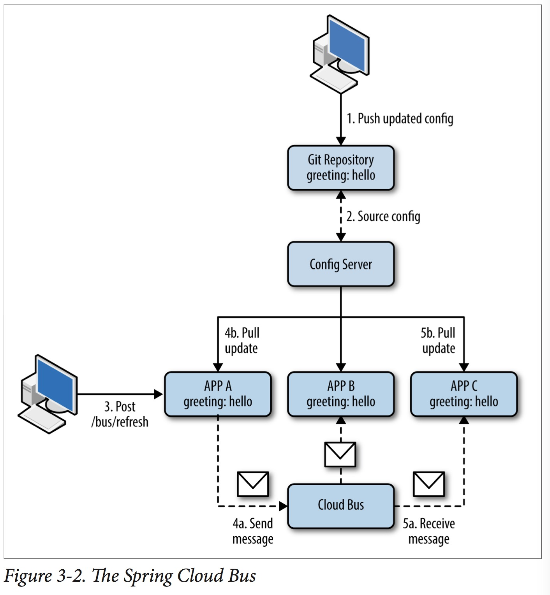

## Service Registration/Discovery

As we create distributed systems, our code’s dependencies cease to be a method call away. Instead, we must make network calls in orderto consume them. How do we perform the necessary wiring to allow all of the microservices within a composed system to communicate with one another?

A common architecture pattern in the cloud (Figure 3-3) is to have frontend (application) and backend (business) services. Backend services are often not accessible directly from the Internet but are rather accessed via the frontend services. The service registry pro‐vides a listing of all services and makes them available to frontend services through a client library (“Routing and Load Balancing” on page 39) which performs load balancing and routing to backend services.

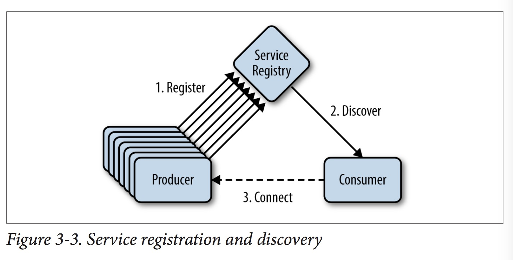

 We’ve solved this problem before using various incarnations of theService Locator and Dependency Injection patterns, and service-oriented architectures have long employed various forms of service registries. We’ll employ a similar solution here by leveraging Eureka, which is a Netflix OSS project that can be used for locating services for the purpose of load balancing and failover of middle-tier services. Consumption of Eureka is further simplified for Spring applications via the Spring Cloud Netflix project, which provides a primarily annotation-based configuration model for consuming NetflixOSS services.

An application leveraging Spring Boot can participate in service registration and discovery simply by adding the @EnableDiscoveryClient annotation (Example 3-3).

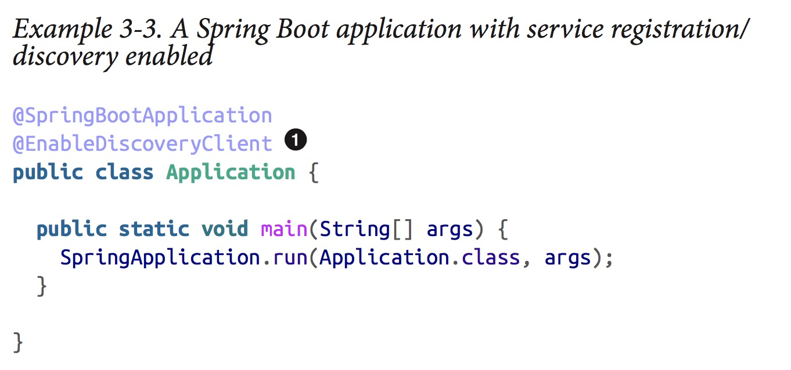

1.  The @EnableDiscoveryClient enables service registration/discovery for this application.

The application is then able to communicate with its dependencies by leveraging the DiscoveryClient. In Example 3-4, the application looks up an instance of a service registered with the name PRODUCER, obtains its URL, and then leverages Spring’s RestTemplate to communicate with it.

 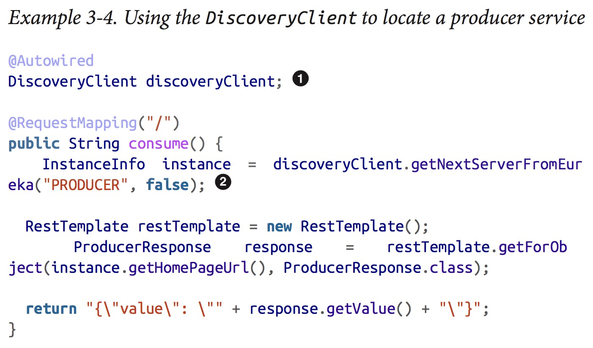

1. The enabled DiscoveryClient is injected by Spring.
2. The getNextServerFromEureka method provides the location of a service instance using a round-robin algorithm.

## Routing and Load Balancing

Basic round-robin load balancing is effective for many scenarios, but distributed systems in cloud environments often demand amore advanced set of routing and load balancing behaviors. These are commonly provided by various external, centralized load balancing solutions. However, it’s often true that such solutions do notpossess enough information or context to make the best choices fora given application as it attempts to communicate with its depen‐dencies. Also, should such external solutions fail, these failures cancascade across the entire architecture.

Cloud-native solutions often often shift the responsibility for making routing and load balancing solutions to the client. One such client-side solution is the Ribbon Netflix OSS project (Figure 3-4).

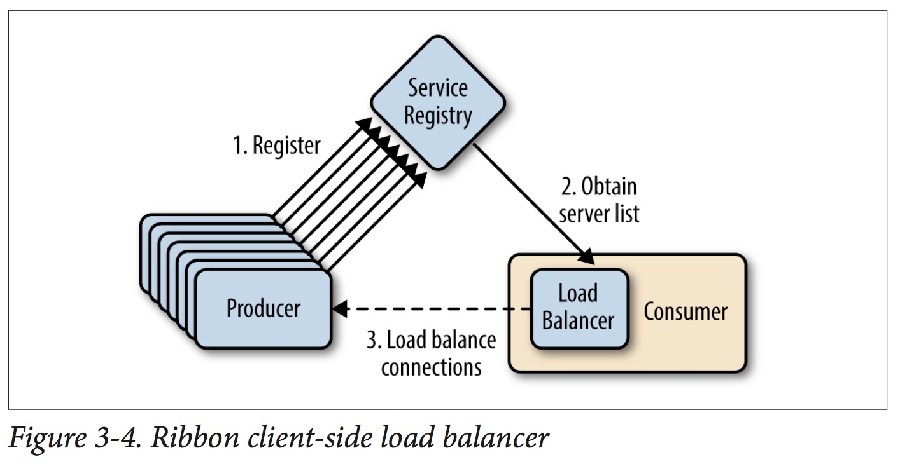

Ribbon provides a rich set of features including:

-   Multiple built-in load balancing rules:

    - Round-robin
    - Average response-time weighted
    - Random
    - Availability filtered (avoid tripped circuits or high concurrent connection counts)

-   Custom load balancing rule plugin system

-   Pluggable integration with service discovery solutions (including Eureka)

-   Cloud-native intelligence such as zone affinity and unhealthy zone avoidance

-   Built-in failure resiliency

As with Eureka, the Spring Cloud Netflix project greatly simplifies aSpring application developer’s consumption of Ribbon. Rather than injecting an instance of DiscoveryClient (for direct consumption of Eureka), developers can inject an instance of LoadBalancerClient, and then use that to resolve an instance of the application’s dependencies (Example 3-5).

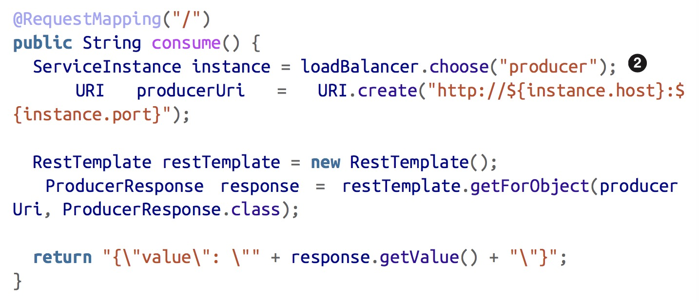

1. The enabled LoadBalancerClient is injected by Spring.
2. The choose method provides the location of a service instance using the currently enabled load balancing algorithm.

Spring Cloud Netflix further simplifies the consumption of Ribbon by creating a Ribbon-enabled RestTemplate bean which can be injected into beans. This instance of RestTemplate is configured toautomatically resolve instances of logical service names to instanceURIs using Ribbon (Example 3-6).

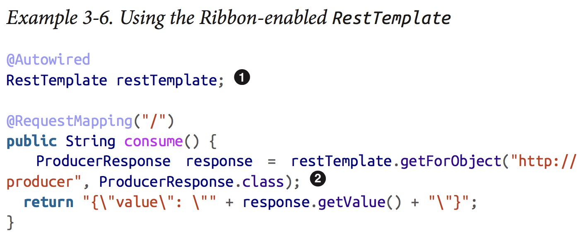

1. RestTemplate is injected rather than a LoadBalancerClient.
2. The injected RestTemplate automatically resolves http://producer to an actual service instance URI.

## Fault-Tolerance

Distributed systems have more potential failure modes than monoliths. As each incoming request must now potentially touch tens (or even hundreds) of different microservices, some failure in one or more of those dependencies is virtually guaranteed.

  Without taking steps to ensure fault tolerance, 30 dependencieseach with 99.99% uptime would result in 2+ hours downtime/month (99.99%^30^ = 99.7% uptime = 2+ hours in a month).

  —Ben Christensen,Netflix Engineer

How do we prevent such failures from resulting in the type of cascading failures that would give us such negative availability numbers? Mike Nygard documented several patterns that can help in his book Release It! (Pragmatic Programmers), including:

**Circuit breakers**

Circuit breakers insulate a service from its dependencies by preventing remote calls when a dependency is determined to be unhealthy, just as electrical circuit breakers protect homes from burning down due to excessive use of power. Circuit breakersare implemented as state machines (Figure 3-5). When in their closed state, calls are simply passed through to the dependency.If any of these calls fails, the failure is counted. When the failure count reaches a specified threshold within a specified time period, the circuit trips into the open state. In the open state,calls always fail immediately. After a predetermined period of time, the circuit transitions into a “half-open” state. In this state, calls are again attempted to the remote dependency. Successful calls transition the circuit breaker back into the closed state, while failed calls return the circuit breaker to the open state.

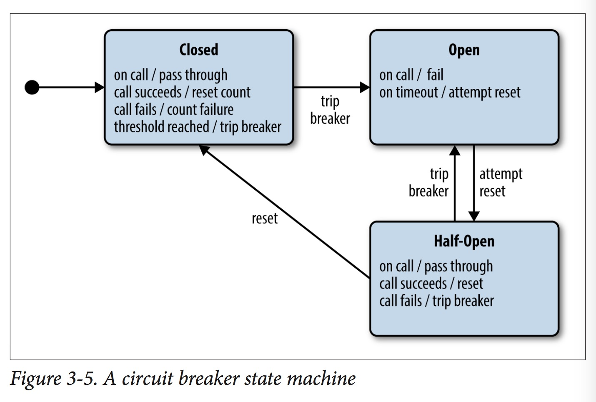

**Bulkheads**

Bulkheads partition a service in order to com fine errors and pre‐vent the entire service from failing due to failure in one area.They are named for partitions that can be sealed to segment a ship into multiple watertight compartments. This can prevent damage (e.g., caused by a torpedo hit) from causing the entire ship to sink. Software systems can utilize bulkheads in manyways. Simply partitioning into microservices is our first line ofdefense. The partitioning of application processes into Linux containers (“Containerization” on page 26) so that one process cannot takeover an entire machine is another. Yet another example is the division of parallelized work into different thread pools.

Netflix has produced a very powerful library for fault tolerance in Hystrix that employs these patterns and more. Hystrix allows code to be wrapped in HystrixCommand objects in order to wrap that code in a circuit breaker.

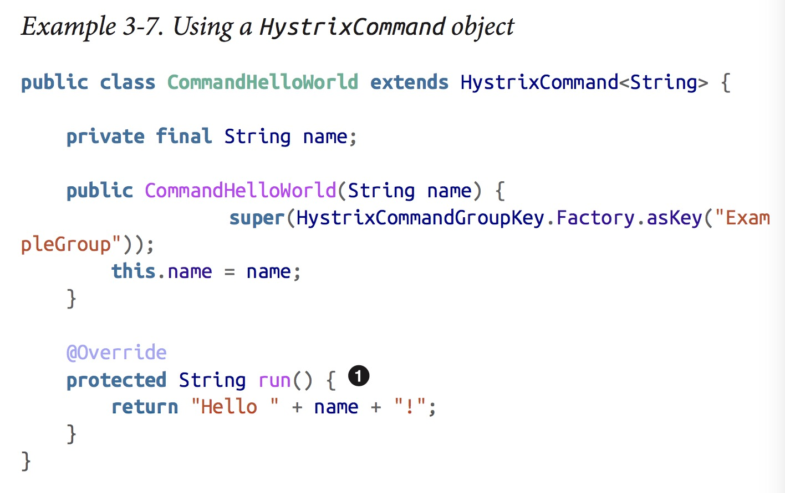

1. The code in the run method is wrapped with a circuit breaker

Spring Cloud Netflix adds an @EnableCircuitBreaker annotation to enable the Hystrix runtime components in a Spring Boot application. It then leverages a set of contributed annotations to make programming with Spring and Hystrix as easy as the earlier integrations we’ve described (Example 3-8).

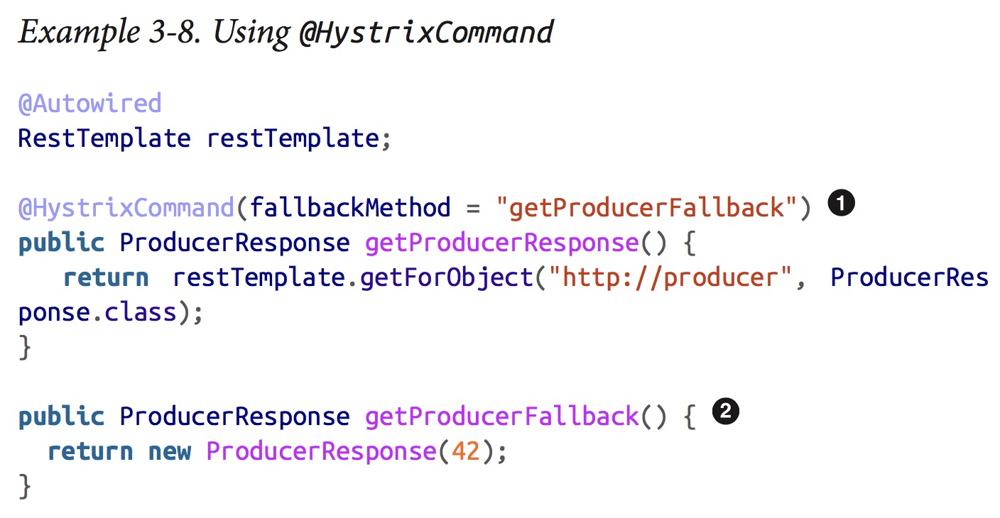

1. The method annotated with @HystrixCommand is wrapped witha circuit breaker.
2. The method getProducerFallback is referenced within theannotation and provides a graceful fallback behavior while thecircuit is in the open or half-open state.

Hystrix is unique from many other circuit breaker implementations in that it also employs bulkheads by operating each circuit breaker within its own thread pool. It also collects many useful metricsabout the circuit breaker’s state, including:

-   Traffic volume

-   Request rate

-   Error percentage

-   Hosts reporting

-   Latency percentiles

-   Successes, failures, and rejections

These metrics are emitted as an event stream which can be aggregated by another Netflix OSS project called Turbine. Individual or aggregated metric streams can then be visualized using a powerful Hystrix Dashboard (Figure 3-6), providing excellent visibility into the overall health of the distributed system.

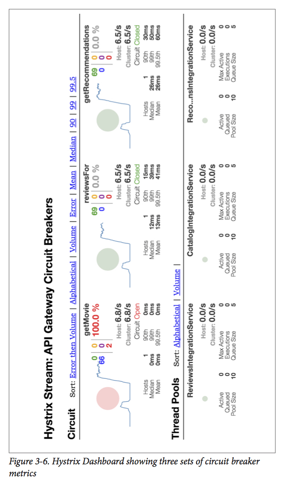 

## API Gateways/Edge Services

In “Mobile Applications and Client Diversity” on page 6 we discussed the idea of server-side aggregation and transformation of an ecosystem of microservices. Why is this necessary?

**Latency**

Mobile devices typically operate on lower speed networks than our in-home devices. The need to connect to tens (or hun‐dreds?) of microservices in order to satisfy the needs of a single application screen would reduce latency to unacceptable levels even on our in-home or business networks. The need for con‐current access to these services quickly becomes clear. It is less expensive and error-prone to capture and implement these con‐current patterns once on the server-side than it is to do the same on each device platform.

A further source of latency is response size. Web service devel‐opment has trended toward the “return everything you mightpossibly need” approach in recent years, resulting in muchlarger response payloads than is necessary to satisfy the needs ofa single mobile device screen. Mobile device developers would prefer to reduce that latency by retrieving only the necessary information and ignoring the remainder.

**Round trips**

Even if network speed was not an issue, communicating with a large number of microservices would still cause problems for mobile developers. Network usage is one of the primary consumers of battery life on such devices. Mobile developers try toeconomize on network usage by making the fewest server-sidecalls possible to deliver the desired user experience.

**Device diversity**

The diversity within the mobile device ecosystem is enormous.Businesses must cope with a growing list of differences across their customer bases, including different:

- Manufacturers
- Device types
- Form factors
- Device sizes
- Programming languages

- Operating systems

- Runtime environments

- Concurrency models

- Supported network protocols

This diversity expands beyond even the mobile device ecosystem, as developers are now targeting a growing ecosystem of in-home consumer devices including smart televisions and set-topboxes.

The API Gateway pattern (Figure 3-7) is targeted at shifting the bur‐den of these requirements from the device developer to the server-side. API gateways are simply a special class of microservices that meet the needs of a single client application (such as a specific iPhone app), and provide it with a single entry point to the backend.They access tens (or hundreds) of microservices concurrently with each request, aggregating the responses and transforming them to meet the client application’s needs. They also perform protocoltranslation (e.g., HTTP to AMQP) when necessary.

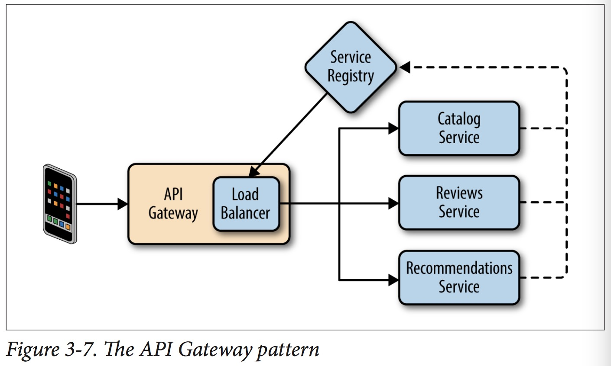

API gateways can be implemented using any language, runtime, orframework that well supports web programming, concurrency pat‐terns, and the protocols necesssary to communicate with the target microservices. Popular choices include Node.js (due to its reactive programming model) and the Go programming language (due to its simple concurrency model).

In this discussion we’ll stick with Java and give an example fromRxJava, a JVM implementation of Reactive Extensions born at Netflix. Composing multiple work or data streams concurrently can be a challenge using only the primitives offered by the Java language, and RxJava is among a family of technologies (also including Reactor) targeted at relieving this complexity.

In this example we’re building a Netflix-like site that presents users with a catalog of movies and the ability to create ratings and reviews for those movies. Further, when viewing a specific title, it provides recommendations to the viewer of movies they might like to watch if they like the title currently being viewed. In order to provide thesecapabilities, three microservices were developed:

- A catalog service

- A reviews service

- A recommendations service

The mobile application for this service expects a response like that found in Example 3-9.

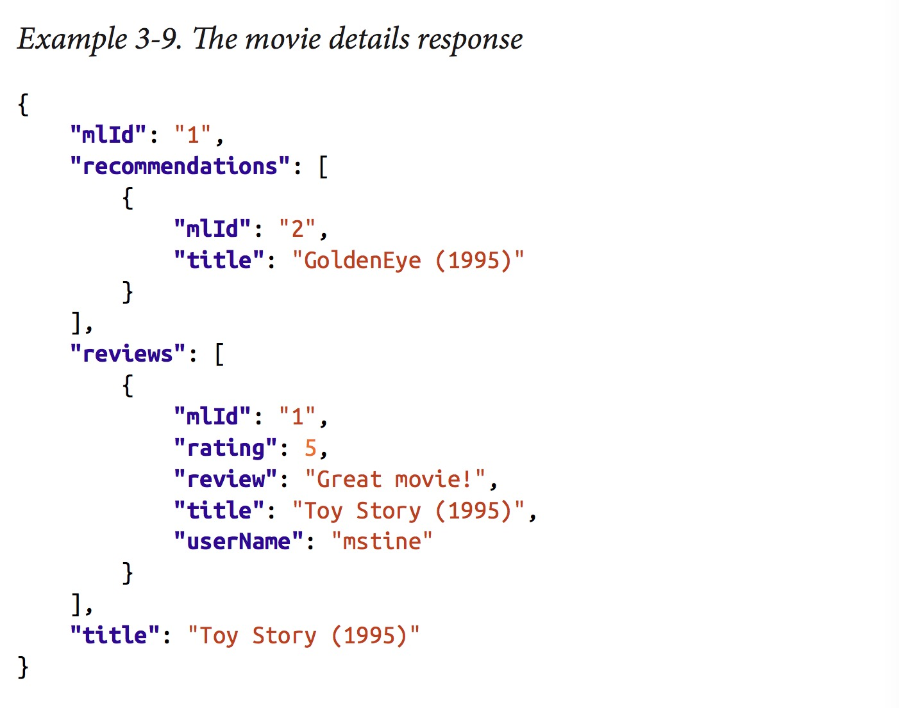

This example barely scratches the surface of the available functionality in RxJava, and the reader is invited to explore the library furtherat RxJava’s wiki.
